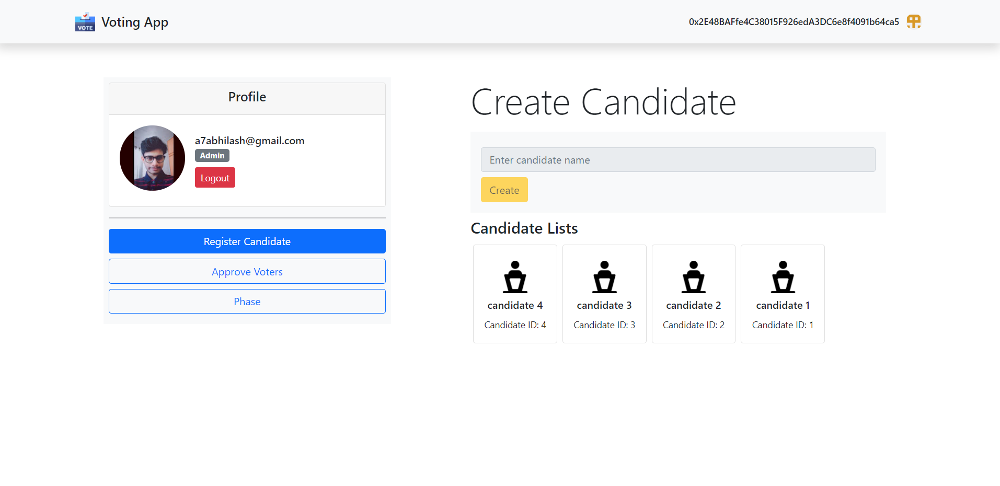
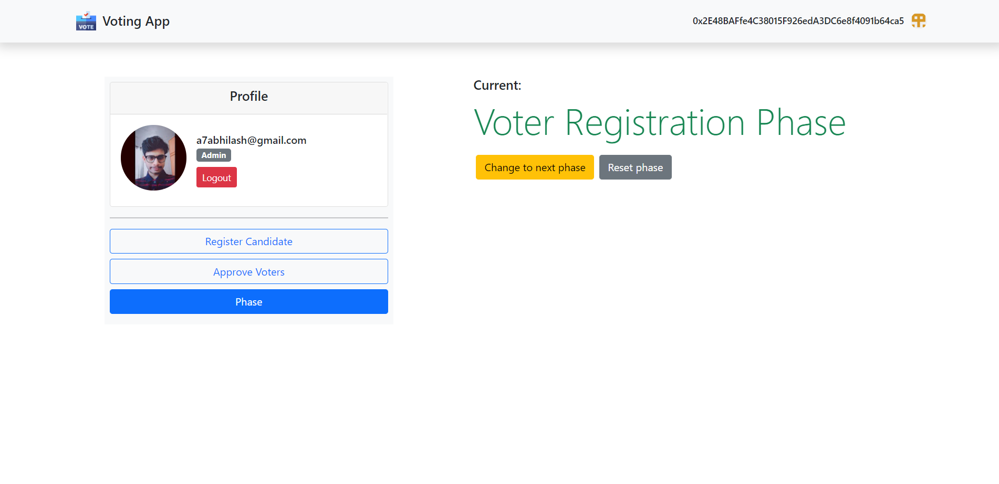
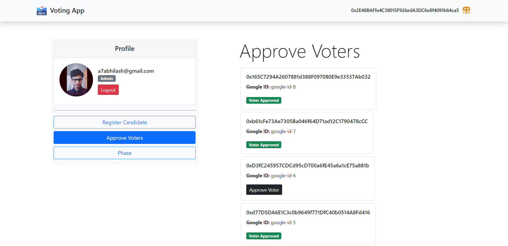
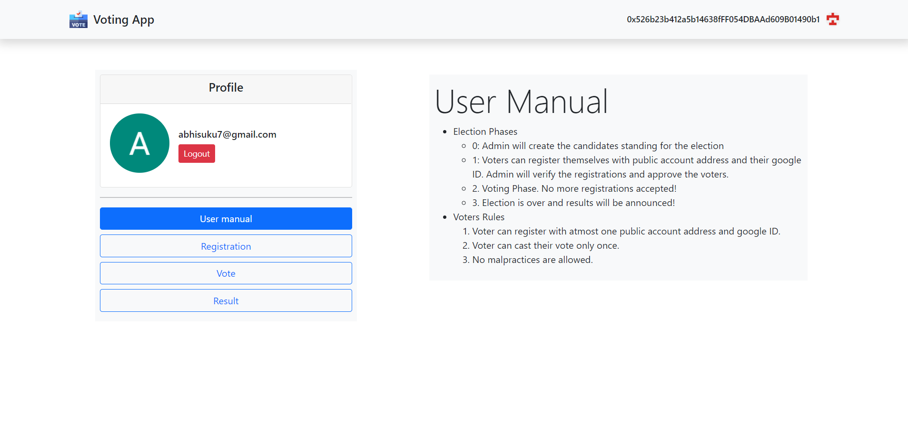
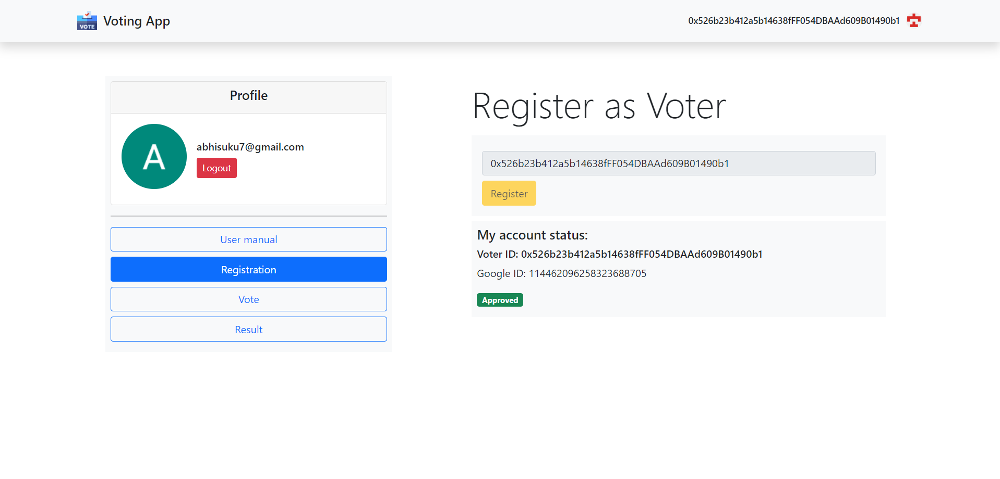
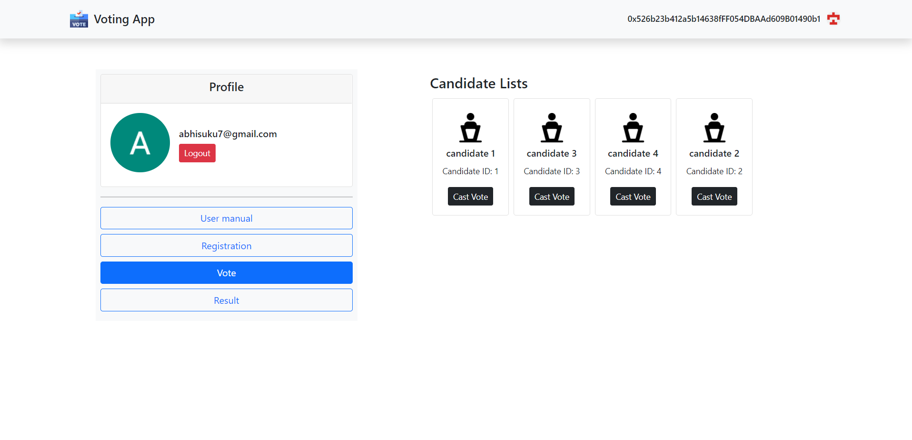
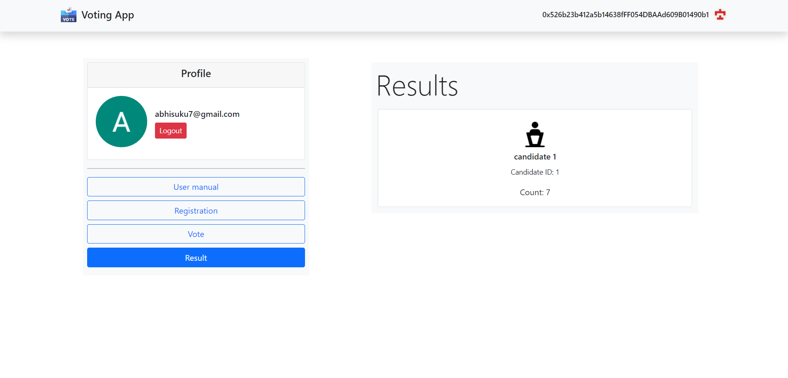

# Decentralized Voting App

### Technologies

`React` `Solidity` `Truffle` `Web3.js`

### Features

- Admin: Create candidates, sets phase of election, can approve voters.
- Voter: Can register themselves with public address and google ID, can cast their vote.

### Screenshots

 

#1 #2 #3 Admin | #4 #5 #6 #7 Voter

